# MetaCall ML Processing: A Cross-Language Performance Analysis

## Introduction

In modern software development, efficiently combining multiple programming languages can be challenging. This experiment demonstrates how MetaCall enables seamless integration between Go and Python
for ML processing, providing significant performance benefits.

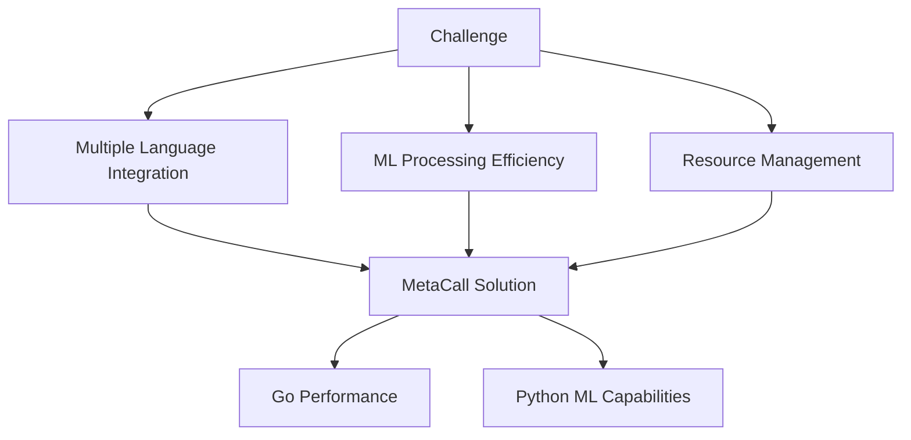

### Project Overview

We process 1000 wine reviews using sentiment analysis, comparing three approaches:

1. Pure Python (Single-threaded)
2. Python with Multiprocessing
3. Go + MetaCall Integration

## Installation and Setup

### Prerequisites

```bash
# System Requirements
- Go 1.22 or later
- Python 3.8 or later
- GNU/Linux system (tested on Fedora/Ubuntu)
```

### Installing MetaCall

1. Clone and Build MetaCall Core:

```bash
# Clone MetaCall repository
git clone https://github.com/metacall/core.git
cd core

# Create build directory
mkdir build && cd build

# Configure with required loaders
cmake \
    -DOPTION_BUILD_LOADERS=ON \
    -DOPTION_BUILD_LOADERS_PY=ON \
    -DOPTION_BUILD_PORTS=ON \
    -DOPTION_BUILD_PORTS_GO=ON \
    -DNODEJS_CMAKE_DEBUG=ON \
    ..

# Build and install
sudo HOME="$HOME" cmake --build . --target install

# Update library cache
sudo ldconfig
```

2. Set Environment Variables:

```bash
# Add to ~/.bashrc or ~/.zshrc
export LOADER_LIBRARY_PATH="/usr/local/lib"
export LOADER_SCRIPT_PATH="`pwd`"
export LD_LIBRARY_PATH=$LD_LIBRARY_PATH:/usr/local/lib
```

### Project Dependencies

1. Python Dependencies:

```bash
pip install transformers torch pandas tqdm
```

2. Go Dependencies:

```bash
go mod init text-classification
go get github.com/metacall/core/source/ports/go_port/source
```

### Project Structure

```
project/
├── wine-reviews.csv
├── ml_processor.py
├── textClassifier.py
├── multithreadedTextClassifier.py
├── main.go
└── go.mod
```

### Verifying Installation

Test your setup with:

```bash
# Check MetaCall installation
metacall --version

# Verify Python environment
python -c "from transformers import pipeline; print('Transformers OK')"

# Test Go environment
go version
```

### Dataset Preparation

The wine-reviews.csv should contain:

-  A 'description' column with wine reviews
-  Text data suitable for sentiment analysis

## Initial Configuration

1. Create ml_processor.py:

```python
from transformers import pipeline

print("Initializing model...")
classifier = pipeline('text-classification',
    model="distilbert-base-uncased-finetuned-sst-2-english",
    device="cpu")
print("Model loaded!")

def process_batch(texts: list[str]) -> list[dict]:
    try:
        results = classifier(texts)
        return results
    except Exception as e:
        print(f"Error processing batch: {str(e)}")
        return []
```

2. Verify Environment:

```bash
# Run a simple test
export LOADER_SCRIPT_PATH="`pwd`"
metacall ml_processor.py
```

# Technical Background

## Understanding Our Processing Pipeline

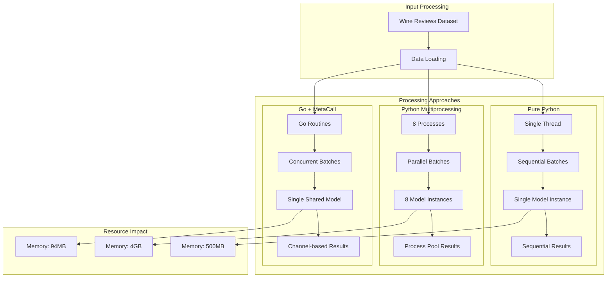

## Python Implementation Analysis

### Single-Threaded Version

```python
# Processing Flow: Sequential
results = classifyTextsBatches(descriptions, batchSize=8)
# Performance: ~38 seconds for 1000 records
# Memory: ~500MB (Python runtime + Model)
```

Key Points:

1. PyTorch/TensorFlow Internal Optimization

   -  Already uses multiple cores for computation
   -  Optimized for tensor operations
   -  Built-in parallelization

2. Memory Pattern:

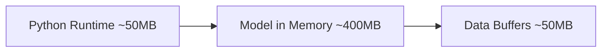

### Python Multiprocessing Version

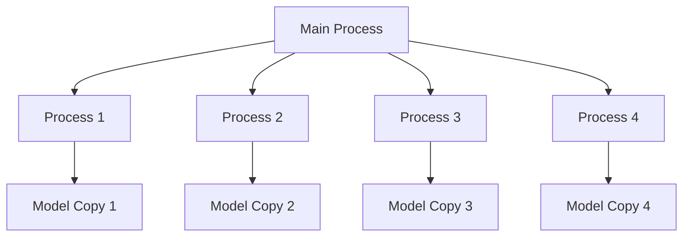

Memory Impact:

-  Each process: ~500MB
-  Total for 8 cores: ~4GB but due to Pythons shared memory optimization could be around 2GB
-  Performance degradation due to:
   -  Resource contention
   -  Model replication
   -  IPC overhead

## Go + MetaCall Implementation

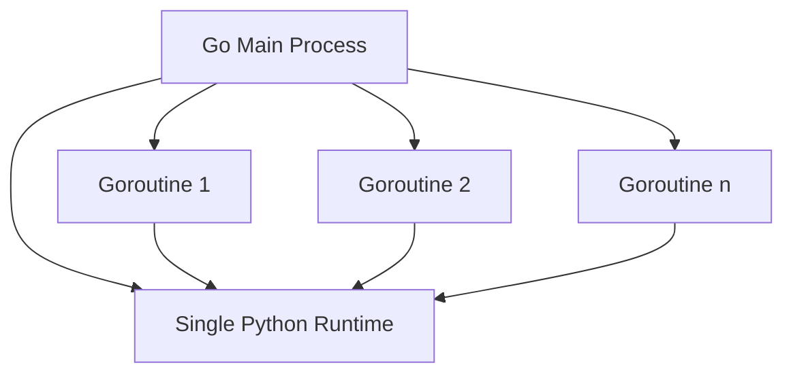

### Key Components:

1. Batch Processor:

```go
type BatchProcessor struct {
    batchSize   int          // Optimized to 32
    numWorkers  int          // Set to CPU count
    inputChan   chan []string
    resultChan  chan []DetailedResult
    // ... other fields
}
```

2. Worker Pool:

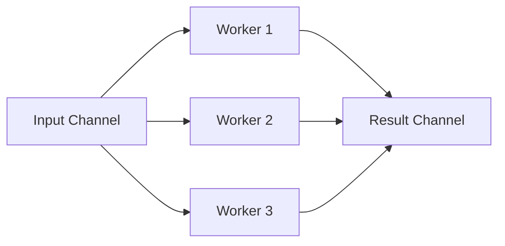

3. Memory Management:

-  Single Python runtime (~500MB)
-  Minimal Go overhead (~2KB per goroutine)
-  Shared model instance
-  Efficient channel communication

Performance Results:

```
Go + MetaCall:
- Processing Time: ~40s
- Memory Usage: ~94MB
- Worker Count: 8
- Batch Size: 32
```

# Performance Analysis

## Implementation Comparisons

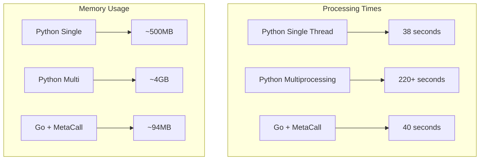

## Detailed Metrics

### 1. Processing Speed

```markdown
| Implementation | Time (s) | Items/second | Batch Size |
| -------------- | -------- | ------------ | ---------- |
| Python Single  | 38       | 26.3         | 8          |
| Python Multi   | 220+     | 4.5          | 8          |
| Go + MetaCall  | 40       | 25.0         | 32         |
```

### 2. Memory Efficiency

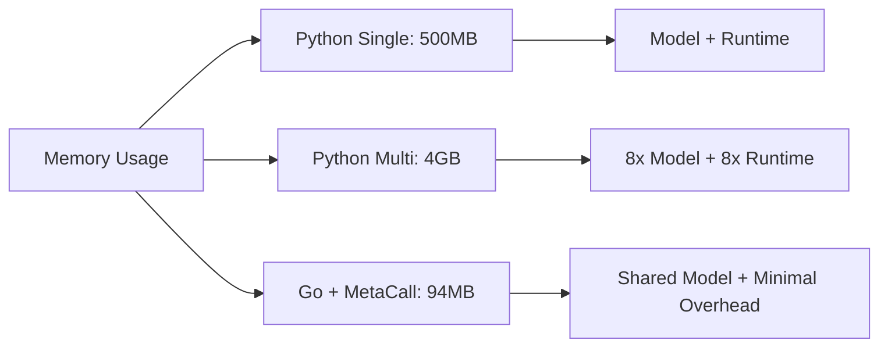

### 3. Batch Processing Analysis

Go + MetaCall Batch Metrics:

```json
{
	"batch_metrics": {
		"batch_size": 32,
		"average_processing_time": "39.84ms",
		"memory_per_batch": "~3MB",
		"concurrent_batches": 8
	}
}
```

## Resource Utilization

### CPU Usage Patterns:

1. Python Single-Thread:

-  4-5 cores at 100% (PyTorch optimization)
-  Context switching overhead minimal
-  Predictable performance

2. Python Multiprocessing:

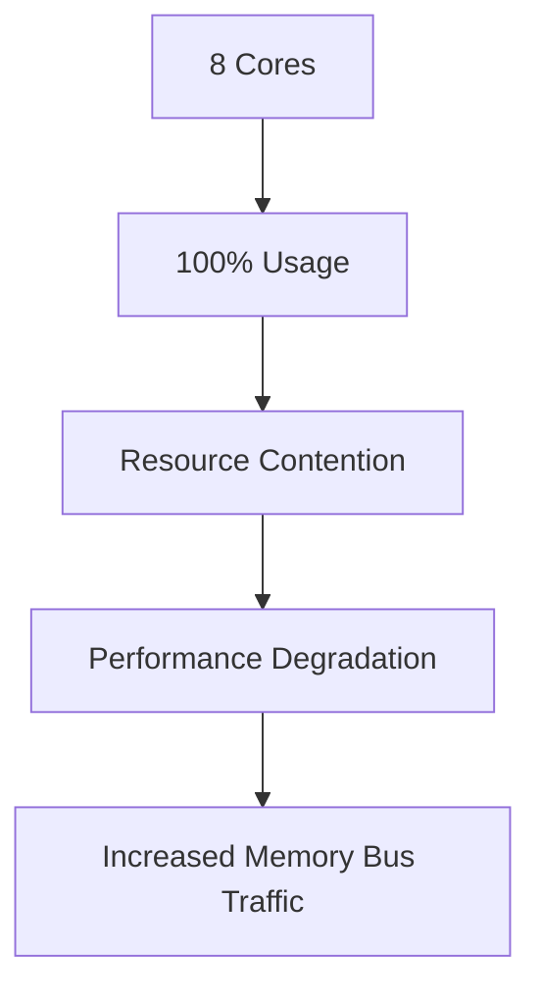

3. Go + MetaCall:

-  Efficient core utilization
-  Minimal context switching
-  Better resource sharing
-  Single model instance benefit

### Memory Analysis

Memory Growth Pattern:

```python
Go + MetaCall:
Initial Memory: ~84MB
Processing Memory: ~94MB
Memory Growth: ~10MB

Python Multi:
Initial Memory: ~500MB
Final Memory: ~4GB
Memory Growth: ~3.5GB
```

## Result Consistency

```markdown
Both implementations showed identical results:

-  Total Records: 1000
-  Negative Results: 46
-  Positive Results: 954
```

## Performance Bottlenecks

1. Python Implementation:

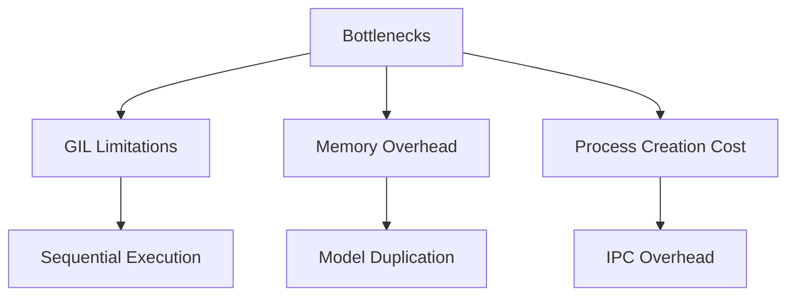

2. Go + MetaCall Benefits:

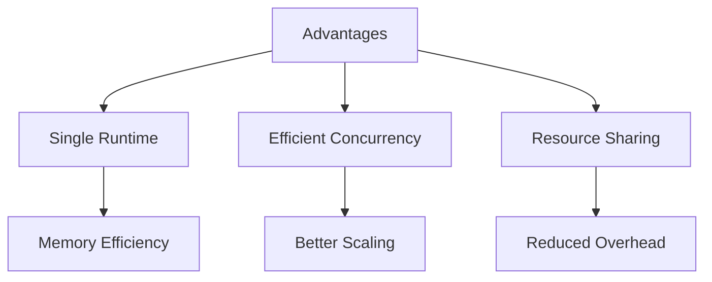

# Real-World Applications

## Use Cases and Benefits

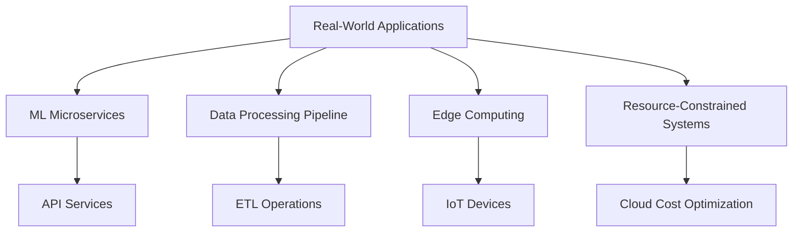

## 1. ML Microservices Architecture

### Traditional Approach

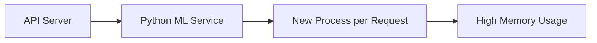

### MetaCall Approach


Example Benefits:

```markdown
| Metric          | Traditional | MetaCall | Savings |
| --------------- | ----------- | -------- | ------- |
| Memory/Instance | ~500MB      | ~100MB   | 80%     |
| Startup Time    | ~2-3s       | ~1s      | 50%     |
| Cost/1000 Reqs  | $X          | $X/5     | 80%     |
```

## 2. Edge Computing Applications

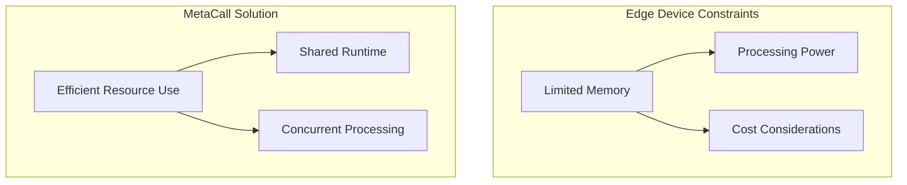

Benefits for Edge Deployment:

1. Lower Memory Footprint

   -  Single model instance
   -  Efficient concurrent processing
   -  Minimal overhead

2. Better Resource Utilization
   -  Shared Python runtime
   -  Go's efficient scheduling
   -  Optimized batch processing

## 3. Scaling Considerations

### Vertical Scaling

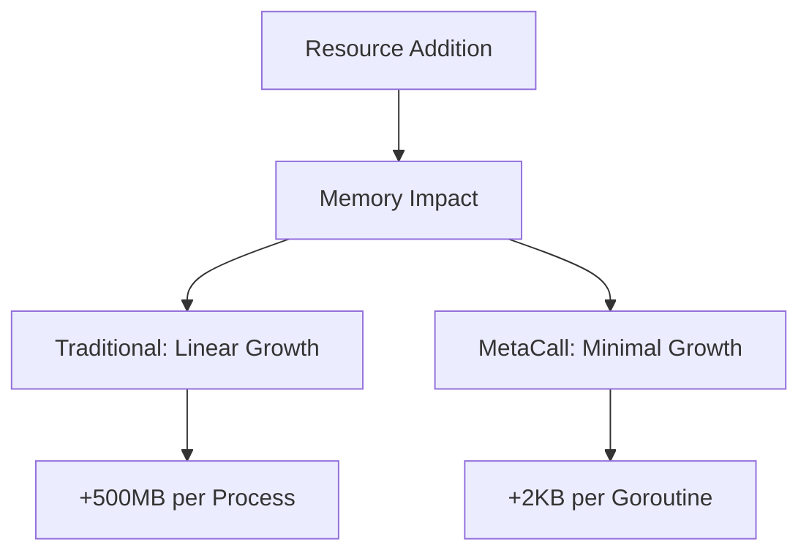

### Horizontal Scaling

Cost Implications:

```python
# Traditional Python Scaling
memory_per_instance = 500 * num_processes  # MB

# MetaCall Scaling
memory_per_instance = 100 + (0.002 * num_concurrent_requests)  # MB
```

## 4. Production Implementation

### Best Practices

1. Resource Configuration:

```go
// Optimal settings based on our experiment
type Config struct {
    BatchSize      int     // 32 for balanced throughput
    NumWorkers     int     // CPU core count
    QueueSize      int     // BatchSize * NumWorkers * 2
    MaxConcurrent  int     // Based on available memory
}
```

2. Monitoring Metrics:

-  Processing time per batch
-  Memory usage patterns
-  Queue depths
-  Error rates

3. Error Handling:

```go
// Implement robust error handling
func processBatch(batch []string) error {
    // Set timeouts
    // Handle partial failures
    // Implement retries
    // Monitor resource usage
}
```

## 5. Cost-Benefit Analysis

### Infrastructure Savings

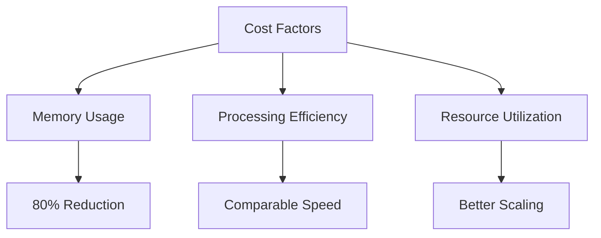

### Development Benefits

1. Language Flexibility

   -  Use Go for performance
   -  Use Python for ML
   -  Clean separation of concerns

2. Maintenance
   -  Single model instance
   -  Simplified deployment
   -  Easier monitoring

# Conclusions and Future Considerations

## Key Findings

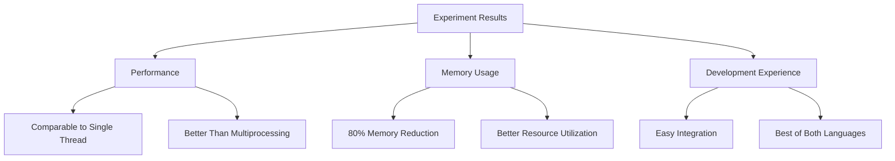

## Performance Summary

### Processing Metrics

```markdown
| Metric              | Python Single | Python Multi | Go + MetaCall |
| ------------------- | ------------- | ------------ | ------------- |
| Processing Time (s) | 38            | 220+         | 40            |
| Memory Usage (MB)   | 500           | 4000         | 94            |
| Scalability         | Limited       | Poor         | Excellent     |
| Resource Efficiency | Moderate      | Poor         | Excellent     |
```

## Advantages and Trade-offs

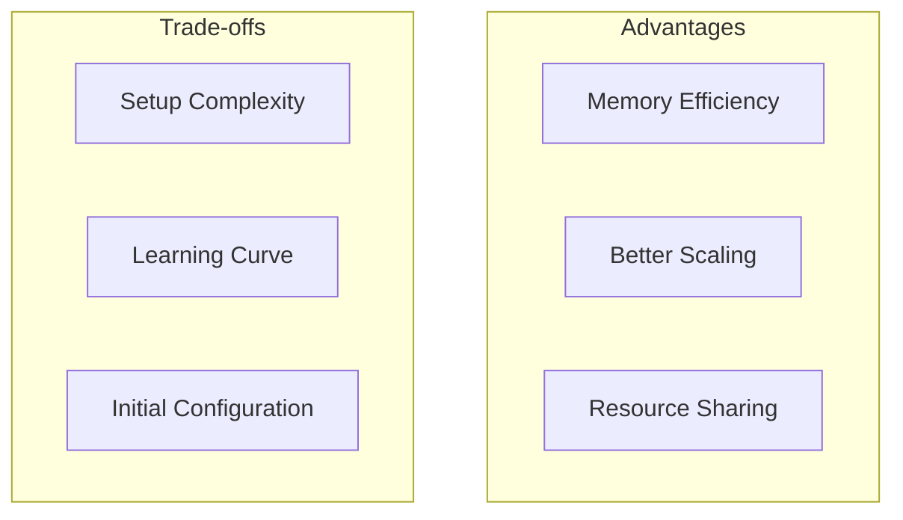

## Future Improvements

1. Performance Optimizations:

```go
// Potential Enhancements
- Dynamic batch sizing
- Adaptive worker pool
- Memory usage optimization
- Smarter queue management
```

2. Feature Additions:

```python
# Possible Extensions
- GPU support
- Multiple model handling
- Auto-scaling capabilities
- Enhanced monitoring
```

## Best Practices Learned

1. Configuration:

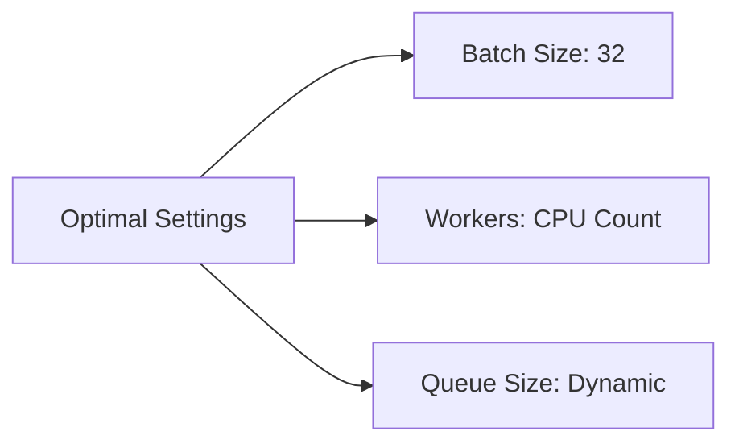

2. Resource Management:

-  Monitor memory usage
-  Track batch processing times
-  Handle errors gracefully
-  Implement proper shutdown

## Migration Considerations

```mermaid
graph TD
    A[Migration Steps] --> B[Install MetaCall]
    B --> C[Port ML Code]
    C --> D[Implement Go Service]
    D --> E[Optimize Settings]

    F[Considerations] --> G[Team Skills]
    F --> H[Infrastructure]
    F --> I[Monitoring]
```

## Final Recommendations

1. Use Case Fit:

-  Large-scale ML processing
-  Resource-constrained environments
-  Microservice architectures
-  Edge computing applications

2. Implementation Strategy:

```markdown
1. Start with small batches
2. Monitor and adjust
3. Gradually scale up
4. Implement proper error handling
5. Set up comprehensive monitoring
```

3. Development Workflow:

```mermaid
graph LR
    A[Development] --> B[Test Small Scale]
    B --> C[Monitor Performance]
    C --> D[Optimize]
    D --> E[Scale Up]
```

## Looking Forward

The experiment demonstrates that MetaCall provides:

1. Significant memory savings
2. Comparable performance
3. Better resource utilization
4. Scalability advantages

This approach is particularly valuable for:

-  Production ML deployments
-  Resource-optimized services
-  Cost-effective scaling
-  Modern microservices
